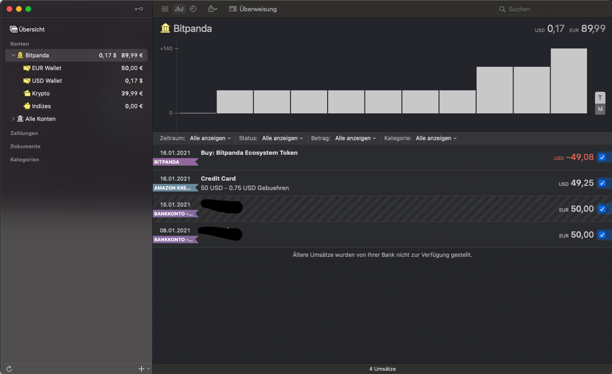
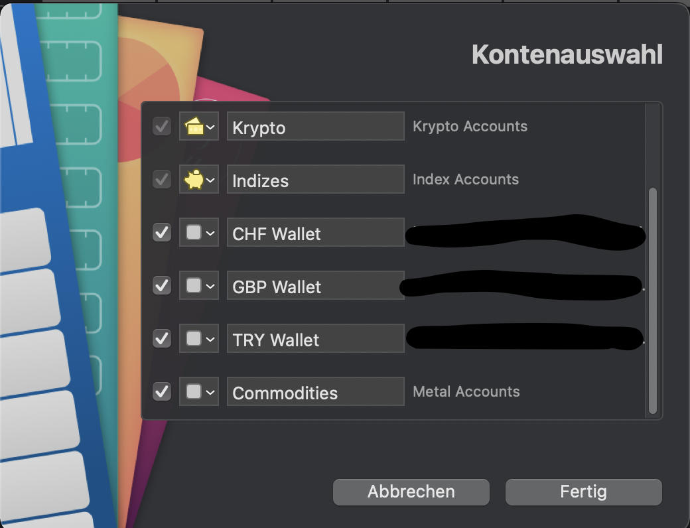

# Inofficial MoneyMoney Web Banking Extension for Bitpanda

Requirements
----------------

* [Bitpanda Account](https://www.bitpanda.com)
* Generate API-Key under your profile
* [MoneyMoney.app](https://moneymoney-app.com) (>= 2.4.3) or beta 

ToDo's
------

* more Testing
* better error handling
* For Feedback/Questions create a [ticket](https://github.com/GimliGloinsSon/MoneyMoney-bitpanda-Extension/issues/new)  

Installation
------------

### Signed copy from Extensions Page (preferred, but you need MoneyMoney >= 2.4.3)

It is not possible to switch to beta mode if you got the app from Apple Appstore.

1. Download a signed version of this from https://moneymoney-app.com/extensions/
  * Open MoneyMoney, tap *Hilfe* > *Zeige Datenbank*
  * put the downloaded `bitpanda.lua` file in the shown Extension folder
2. Add an account in MoneyMoney
  * create a new account via *Konto* > *Konto hinzufügen*.
  * Use the API-Key you created at Bitpanda profile for the API-Key

### Usigned copy from the GitHub-Repository

* Copy the `bitpanda.lua` file into MoneyMoney's Extension folder
  * Open MoneyMoney.app
	* Tap "Hilfe", "Show Database in Finder"
	* Copy `bitapanda.lua` into Extensions Folder
* Disable Signature Check (Needs beta Version!)
  * Open MoneyMoney.app
	* Enable Beta-Updates
	* Install update
	* Go to "Extensions"-tab
	* Allow unsigned extensions

Information to Indizes
----------------------

If you see in your FIAT-wallet a buy and a sell of the same day of the same index,
that means that there was a rebalancing of the index.

Information for staked Cryptos
------------------------------

With version 1.5 of the extension, also „staked“ crypto coins are shown in an own wallet. 
The quantity of the coins will be calculated from the staking and unstaking transfers 
which the API from Bitpanda delivers. Unfortunately, the API does not deliver any information 
about rewards which are received from staking or the quantity of the crypto which is staked. 
The value which is shown by the extension is only an approximate value. The "staked wallet"
will only be shown if the sum of staking(+) and unstaking(-) is bigger than 0.
For the correct value, have a look at Bitpanda.

Usage
-----

* For API-Key: API-Key from Bitpanda
  * in Versions lower than 2.4.3 put the API-Key in the field username, in the field password you can type whatever you want  	

* At "Kontenauswahl" you can select your:
    * Money Wallets (EUR, USD, CHF, GBP, TRY, CZK, DKK, HUF, PLN, SEK)
    * Cryptocoin wallets
    * Index wallets
    * Commodity (metal) wallets
    * Stock wallets
    * ETF wallets
    * ETC (Ressource) wallets

Version history
---------------

* 1.5:
    * possibility to show staked Cryptos
        * Please read the "Information for staked Cryptos"

* 1.4:
    * bugfix issues with Bitpanda CashPlus

* 1.31:
    * bugfix calculate index transactions

* 1.3:
    * use mew api to get prices

* 1.22:
    * bugfix getting Index names

* 1.21:
    * show wallets for staked cryptos

* 1.2:
    * added ETF and ETC (Ressource) wallets

* 1.12:
    * performance optimization if there are no stock wallets

* 1.11:
    * detailed information for dividend in FIAT transaction

* 1.1:
    * added Stock wallets portfolio

* 1.02:
    * filter canceled fiat transactions
    * added Stock wallets IN FIAT transactions

* 1.01:
    * performance improvement

* 1.0:
    * initial version
