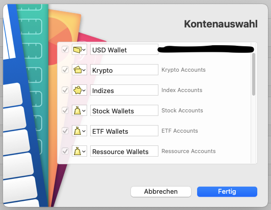

# Inofficial MoneyMoney Web Banking Extension for Bitpanda

Requirements
----------------

* [Bitpanda Account](https://www.bitpanda.com)
* Generate API-Key under your profile
* [MoneyMoney.app](https://moneymoney-app.com) (>= 2.4.3) or beta 

ToDo's
------

* more Testing
* better error handling
* For Feedback/Questions create a [ticket](https://github.com/GimliGloinsSon/MoneyMoney-bitpanda-Extension/issues/new)  

Installation
------------

### Usigned copy from the GitHub-Repository

* Copy the `bitpanda.lua` file into MoneyMoney's Extension folder
  * Open MoneyMoney.app
	* Tap "Hilfe", "Show Database in Finder"
	* Copy `bitapanda.lua` into Extensions Folder
* Disable Signature Check (Needs beta Version!)
  * Open MoneyMoney.app
	* Enable Beta-Updates
	* Install update
	* Go to "Extensions"-tab
	* Allow unsigned extensions

Usage
-----

* For Username: API-Key from Bitpanda

* At "Kontenauswahl" you can select your:
    * Money Wallets (EUR, USD, CHF, GBP, TRY)
    * Cryptocoin wallets
    * Index wallets
    * Commodity (metal) wallets

